# Web Book Register Application on Ubuntu AWS

---

## Task

In this project, we will implement a simple **Book Register** web form using the **MEAN** stack.

---

## Step 0: Preparing Prerequisites

In order to complete this project, you will need an AWS account and a virtual server with Ubuntu Server OS.

Create a new EC2 instance of the t2.micro family with Ubuntu Server 24.04 LTS (HVM) image. 
   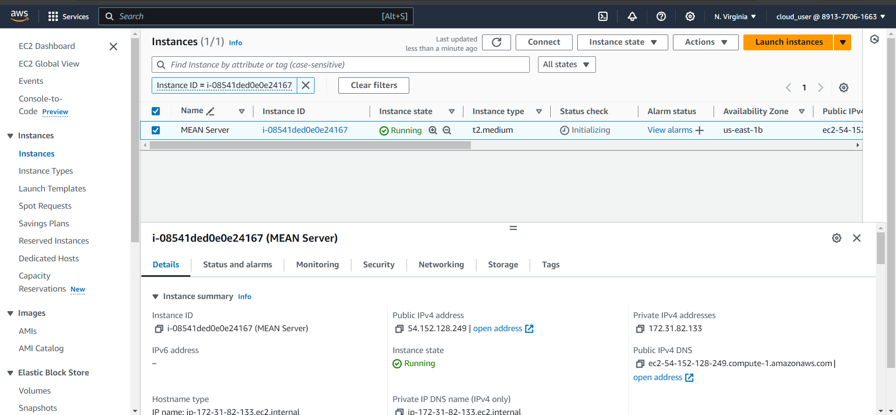

Connect to the instance:
   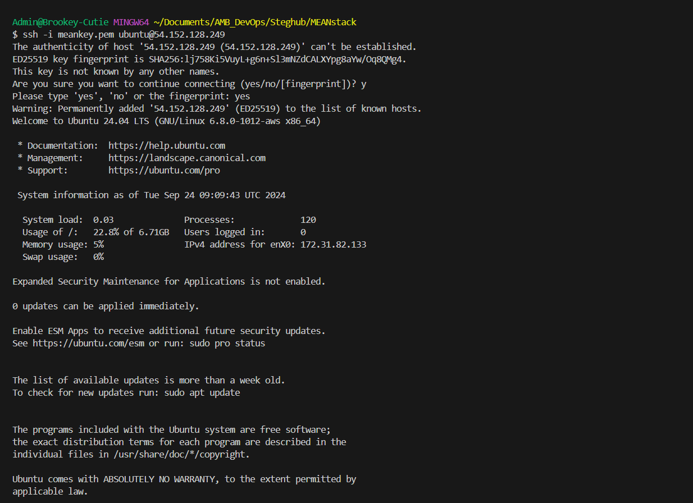


## Step 1: Install Node.js

Node.js is a JavaScript runtime built on Chrome's V8 JavaScript engine. Node.js is used in this tutorial to set up Express routes and AngularJS controllers.

1. Update Ubuntu:
    ```bash
    sudo apt update
    ```

2. Upgrade Ubuntu:
    ```bash
    sudo apt upgrade
    ```

3. Add certificates:
    ```bash
    sudo apt -y install curl dirmngr apt-transport-https lsb-release ca-certificates
    curl -sL https://deb.nodesource.com/setup_18.x | sudo -E bash -
    ```
   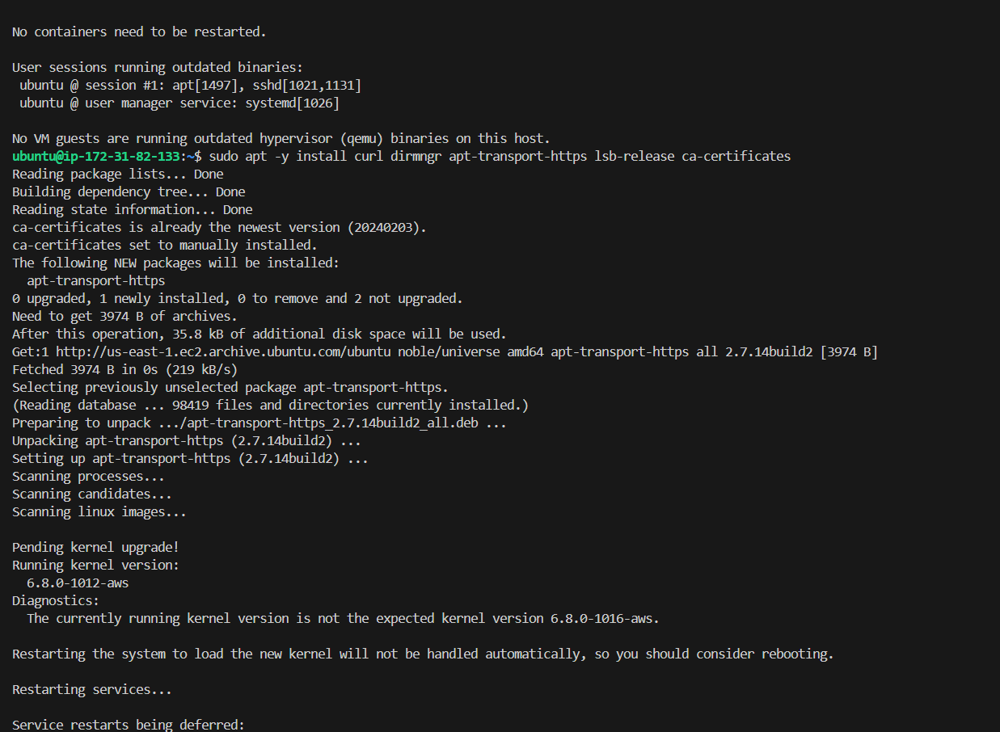
   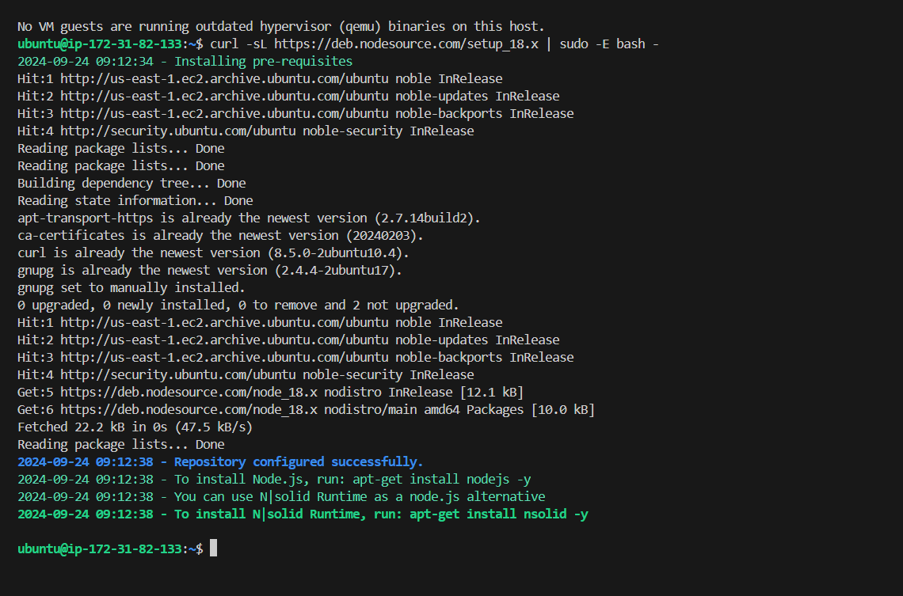


4. Install Node.js:
    ```bash
    sudo apt install -y nodejs
    ```
   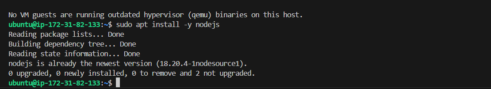

   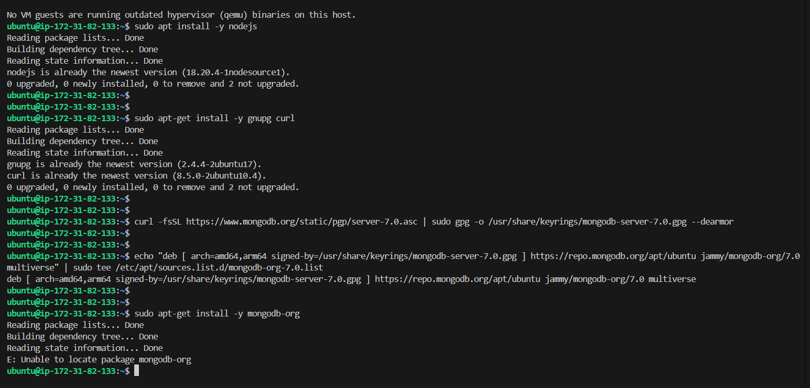

---

## Step 2: Install MongoDB

MongoDB stores data in flexible, JSON-like documents. For this application, we will add book records containing book name, ISBN number, author, and the number of pages.

1. Install MongoDB:
    ```bash
    sudo apt-get install -y gnupg curl
    curl -fsSL https://www.mongodb.org/static/pgp/server-7.0.asc | sudo gpg -o /usr/share/keyrings/mongodb-server-7.0.gpg --dearmor
    echo "deb [ arch=amd64,arm64 signed-by=/usr/share/keyrings/mongodb-server-7.0.gpg ] https://repo.mongodb.org/apt/ubuntu jammy/mongodb-org/7.0 multiverse" | sudo tee /etc/apt/sources.list.d/mongodb-org-7.0.list
    sudo apt-get install -y mongodb-org
    ```
**Note:** Update the package list before installing mongodb correctly
    Now, update the package lists from the newly added MongoDB repository.

    ```bash
    sudo apt-get update
    ```
   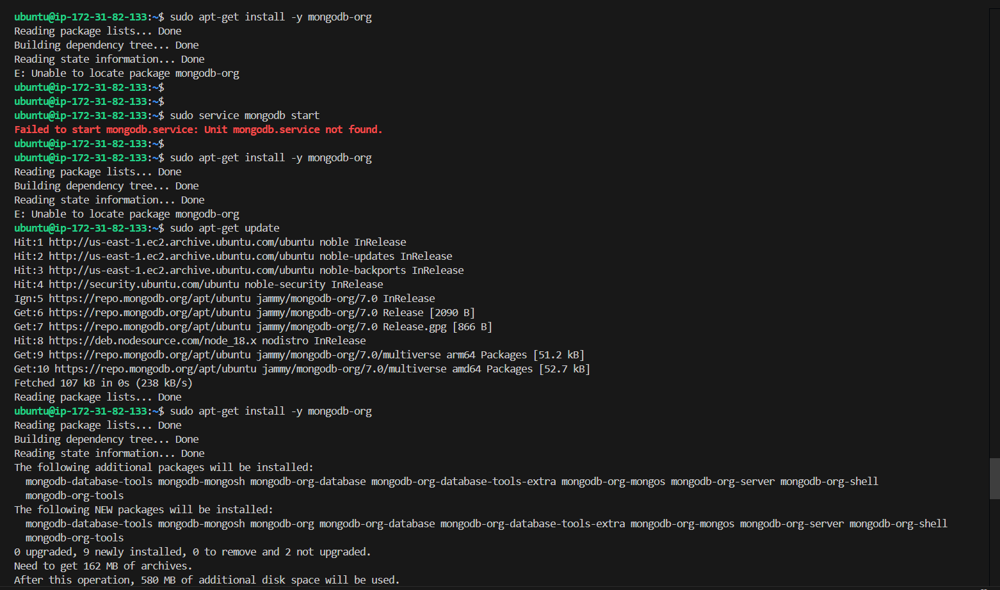

2. Start the MongoDB server:
    ```bash
    sudo service mongod start
    ```
    OR
    ```bash
    sudo systemctl start mongod
    ```

3. Verify that the MongoDB service is up and running:
    ```bash
    sudo systemctl status mongodb
    ```
   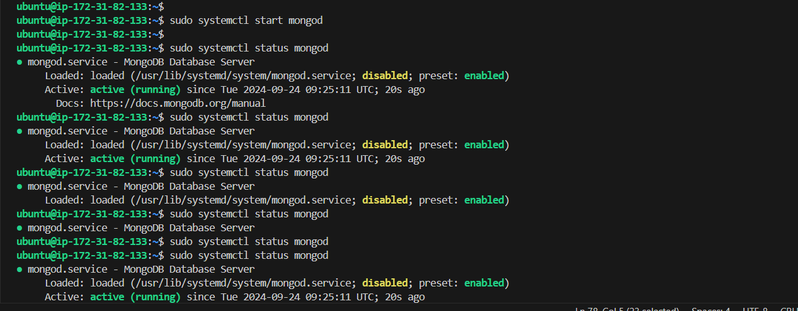


4. Install npm (Node Package Manager):
    ```bash
    sudo apt install -y npm
    ```
    **Note:** I faced issues with installing the npm, so I used aptitude to Resolve Dependencies. If you face issues, you can try using aptitude (an alternative package manager) to handle the dependency resolution:

    1. Install aptitude:

        ```bash
        sudo apt install aptitude
        Then, try installing npm using:
        ```

        ```bash
        sudo aptitude install npm
        ```
   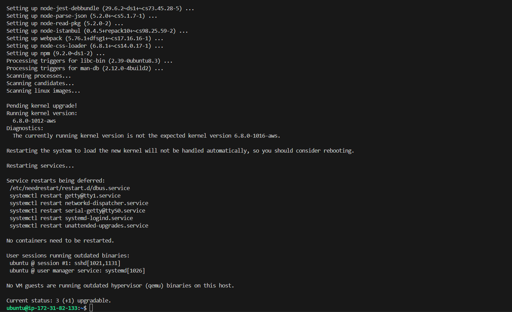

5. Install the `body-parser` package:
    ```bash
    sudo npm install body-parser
    ```

6. Create a folder for the project:
    ```bash
    mkdir Books && cd Books
    ```

7. Initialize the npm project:
    ```bash
    npm init
    ```
   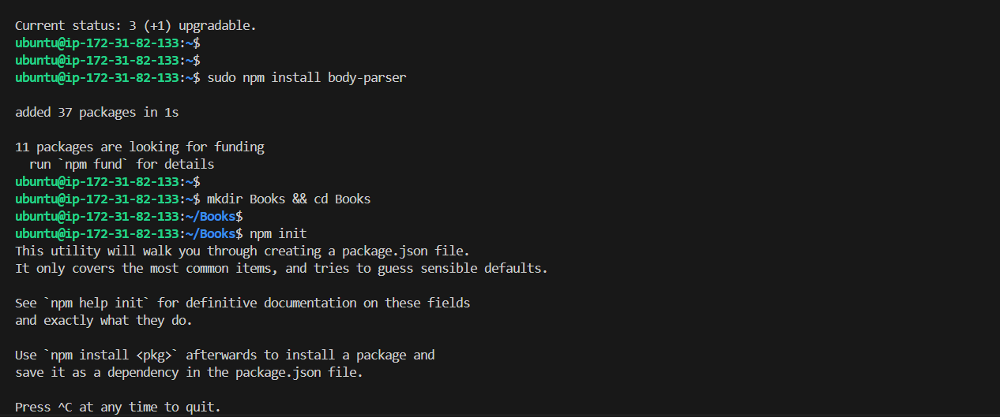

8. Create a file named `server.js` and add the following code:

    ```javascript
    const express = require('express');
    const bodyParser = require('body-parser');
    const mongoose = require('mongoose');
    const path = require('path');
    const app = express();
    const PORT = process.env.PORT || 3300;

    // MongoDB connection
    mongoose.connect('mongodb://localhost:27017/test', {
        useNewUrlParser: true,
        useUnifiedTopology: true,
    })
    .then(() => console.log('MongoDB connected'))
    .catch(err => console.error('MongoDB connection error:', err));

    app.use(express.static(path.join(__dirname, 'public')));
    app.use(bodyParser.json());

    require('./apps/routes')(app);

    app.listen(PORT, () => {
        console.log(`Server up: http://localhost:${PORT}`);
    });
    ```
   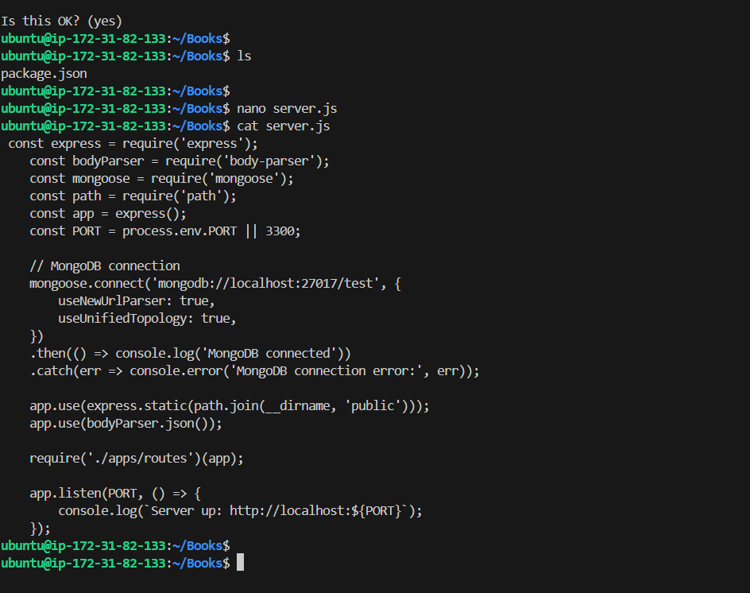

---

## Step 3: Install Express and Set Up Routes

1. Install Express and Mongoose:
    ```bash
    sudo npm install express mongoose
    ```

2. Create a folder named `apps`:
    ```bash
    mkdir apps && cd apps
    ```

3. Create a file named `routes.js` and add the following code:

    ```javascript
    const Book = require('./models/book');
    const path = require('path');

    module.exports = function(app) {
        app.get('/book', async (req, res) => {
            try {
                const books = await Book.find();
                res.json(books);
            } catch (err) {
                res.status(500).json({ message: 'Error fetching books', error: err.message });
            }
        });

        app.post('/book', async (req, res) => {
            try {
                const book = new Book({
                    name: req.body.name,
                    isbn: req.body.isbn,
                    author: req.body.author,
                    pages: req.body.pages
                });
                const savedBook = await book.save();
                res.status(201).json({
                    message: 'Successfully added book',
                    book: savedBook
                });
            } catch (err) {
                res.status(400).json({ message: 'Error adding book', error: err.message });
            }
        });

        app.delete('/book/:isbn', async (req, res) => {
            try {
                const result = await Book.findOneAndDelete({ isbn: req.params.isbn });
                if (!result) {
                    return res.status(404).json({ message: 'Book not found' });
                }
                res.json({ message: 'Successfully deleted the book', book: result });
            } catch (err) {
                res.status(500).json({ message: 'Error deleting book', error: err.message });
            }
        });

        app.get('*', (req, res) => {
            res.sendFile(path.join(__dirname, '../public', 'index.html'));
        });
    };
    ```
   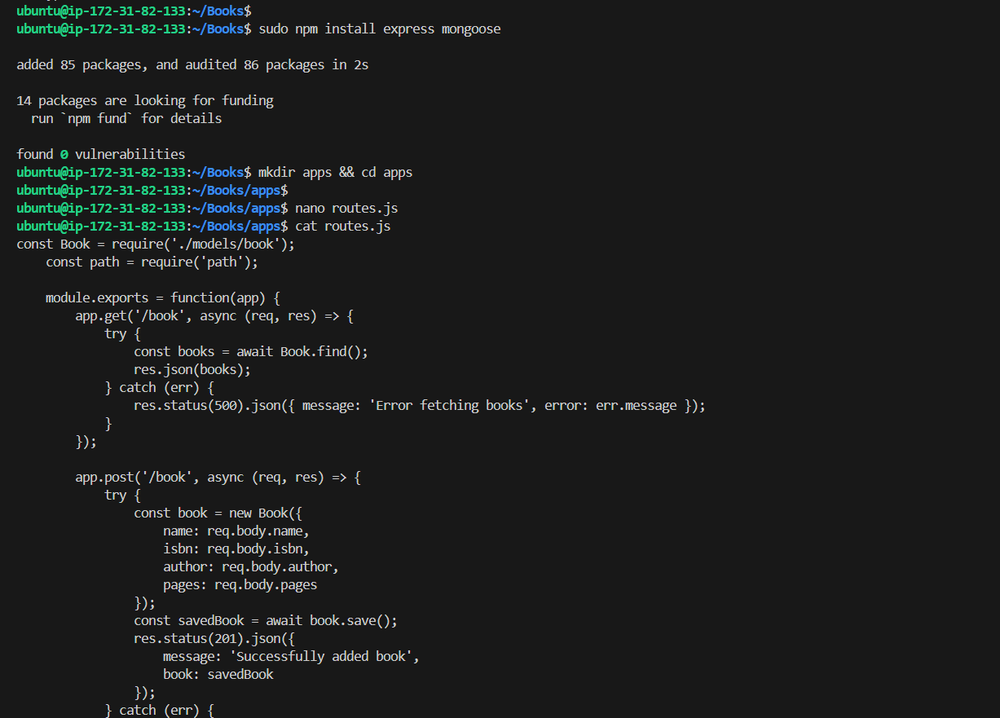

4. Create a folder named `models`:
    ```bash
    mkdir models && cd models
    ```

5. Create a file named `book.js` and add the following code:

    ```javascript
    const mongoose = require('mongoose');

    const bookSchema = new mongoose.Schema({
        name: { type: String, required: true },
        isbn: { type: String, required: true, unique: true, index: true },
        author: { type: String, required: true },
        pages: { type: Number, required: true, min: 1 }
    }, {
        timestamps: true
    });

    module.exports = mongoose.model('Book', bookSchema);
    ```
   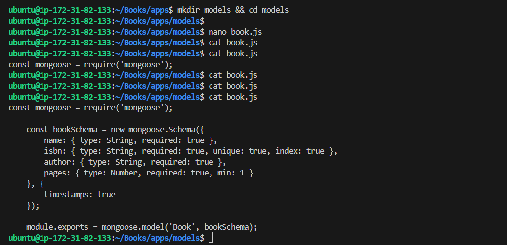

---

## Step 4: Access the Routes with AngularJS

1. Change the directory back to `Books`:
    ```bash
    cd ../..
    ```

2. Create a folder named `public`:
    ```bash
    mkdir public && cd public
    ```
   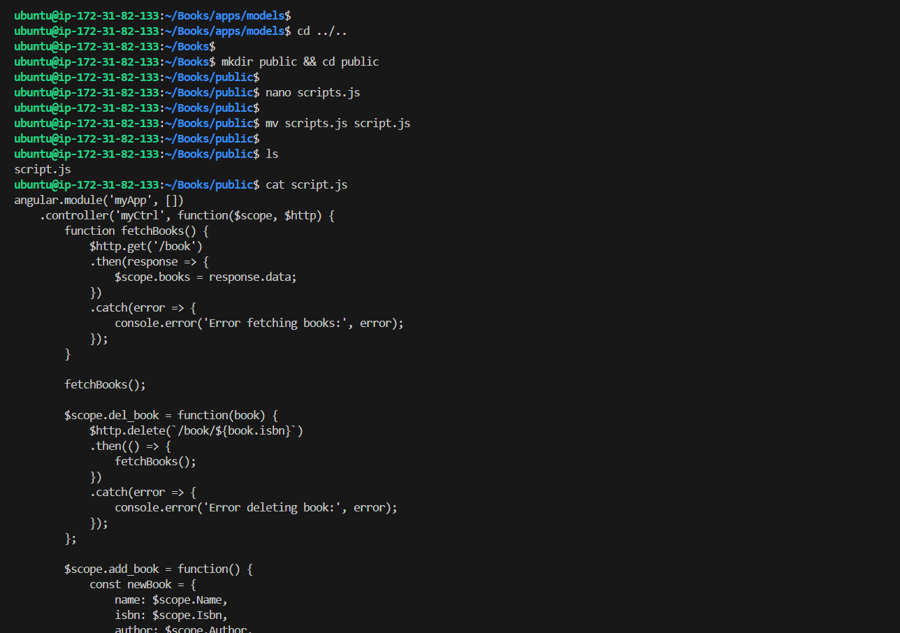

3. Create a file named `script.js` and add the following code:

    ```javascript
    angular.module('myApp', [])
    .controller('myCtrl', function($scope, $http) {
        function fetchBooks() {
            $http.get('/book')
            .then(response => {
                $scope.books = response.data;
            })
            .catch(error => {
                console.error('Error fetching books:', error);
            });
        }

        fetchBooks();

        $scope.del_book = function(book) {
            $http.delete(`/book/${book.isbn}`)
            .then(() => {
                fetchBooks();
            })
            .catch(error => {
                console.error('Error deleting book:', error);
            });
        };

        $scope.add_book = function() {
            const newBook = {
                name: $scope.Name,
                isbn: $scope.Isbn,
                author: $scope.Author,
                pages: $scope.Pages
            };

            $http.post('/book', newBook)
            .then(() => {
                fetchBooks();
                // Clear form fields
                $scope.Name = $scope.Isbn = $scope.Author = $scope.Pages = '';
            })
            .catch(error => {
                console.error('Error adding book:', error);
            });
        };
    });
    ```

4. In the `public` folder, create a file named `index.html` and add the following code:

    ```html
    <!DOCTYPE html>
    <html ng-app="myApp" ng-controller="myCtrl">
    <head>
        <meta charset="UTF-8">
        <meta name="viewport" content="width=device-width, initial-scale=1.0">
        <title>Book Management</title>
        <script src="https://ajax.googleapis.com/ajax/libs/angularjs/1.8.2/angular.min.js"></script>
        <script src="script.js"></script>
        <style>
            body { font-family: Arial, sans-serif; margin: 20px; }
            table { border-collapse: collapse; width: 100%; }
            th, td { border: 1px solid #ddd; padding: 8px; text-align: left; }
            th { background-color: #f2f2f2; }
            input[type="text"], input[type="number"] { width: 100%; padding: 5px; }
            button { margin-top: 10px; padding: 5px 10px; }
        </style>
    </head>
    <body>
        <h1>Book Management Application</h1>

        <form ng-submit="add_book()">
            <label>Name:</label>
            <input type="text" ng-model="Name" required>

            <label>ISBN:</label>
            <input type="text" ng-model="Isbn" required>

            <label>Author:</label>
            <input type="text" ng-model="Author" required>

            <label>Pages:</label>
            <input type="number" ng-model="Pages" required>

            <button type="submit">Add Book</button>
        </form>

        <h2>Books</h2>

        <table>
            <thead>
                <tr>
                    <th>Name</th>
                    <th>ISBN</th>
                    <th>Author</th>
                    <th>Pages</th>
                    <th>Action</th>
                </tr>
            </thead>
            <tbody>
                <tr ng-repeat="book in books">
                    <td>{{ book.name }}</td>
                    <td>{{ book.isbn }}</td>
                    <td>{{ book.author }}</td>
                    <td>{{ book.pages }}</td>
                    <td><button ng-click="del_book(book)">Delete</button></td>
                </tr>
            </tbody>
        </table>
    </body>
    </html>
    ```

---

## Step 5: Run the App

Go back to the project root directory and run the following command:

```bash
node server.js
```
   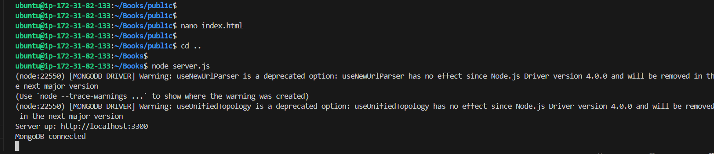
   
The server is now up and running, we can connect it via port 3300. To access it from the Internet, you need to open TCP port 3300 in your AWS Web Console for your EC2 Instance.

   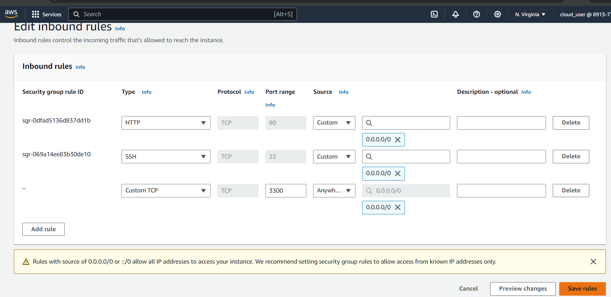

You should now be able to access your Book Register Application by opening a browser and going to http://<your_server_public_ip>:3300
   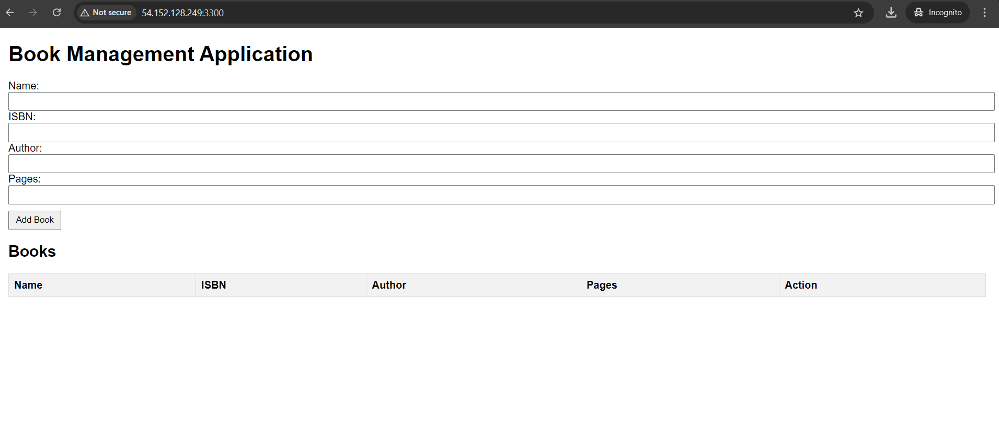

Testing the Book Register Application:
   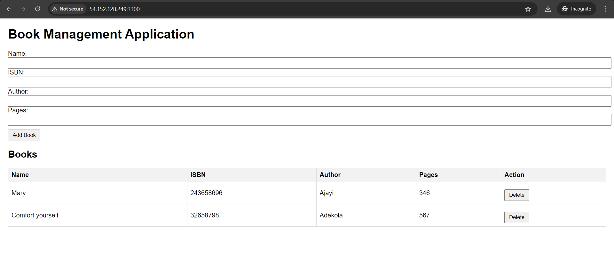
